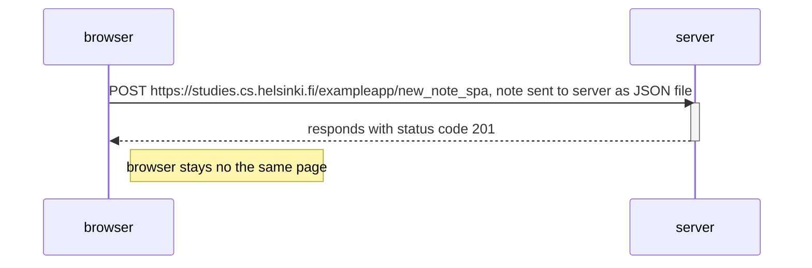

### Single-page app new note

```mermaid
sequenceDiagram
    participant browser
    participant server

    browser->>server: POST https://studies.cs.helsinki.fi/exampleapp/new_note_spa, note sent to server as JSON file
    activate server
    server-->>browser: responds with status code 201
    deactivate server

    Note right of browser: browser stays no the same page
```
